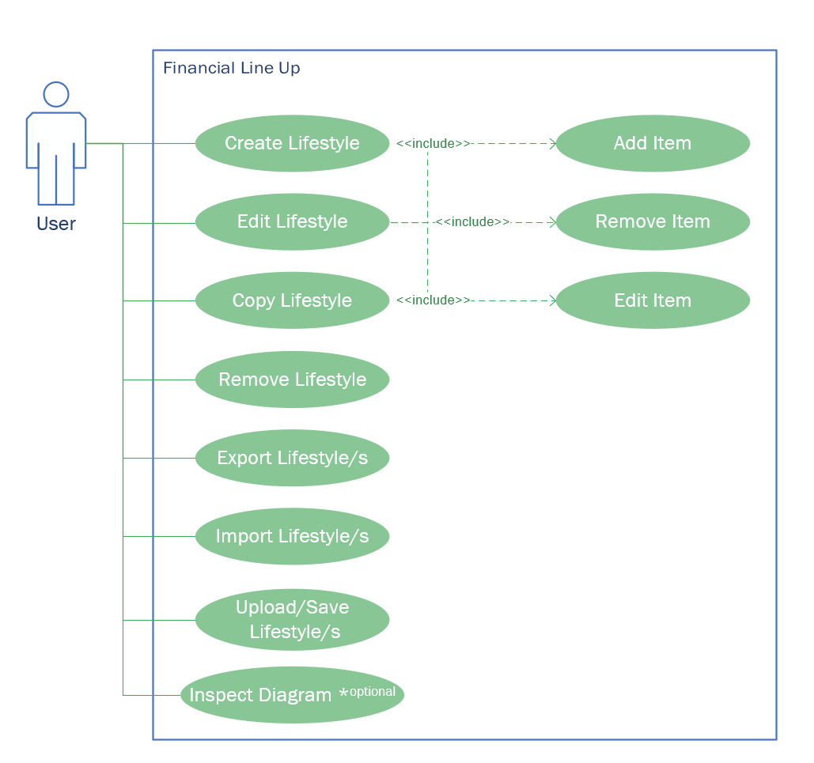
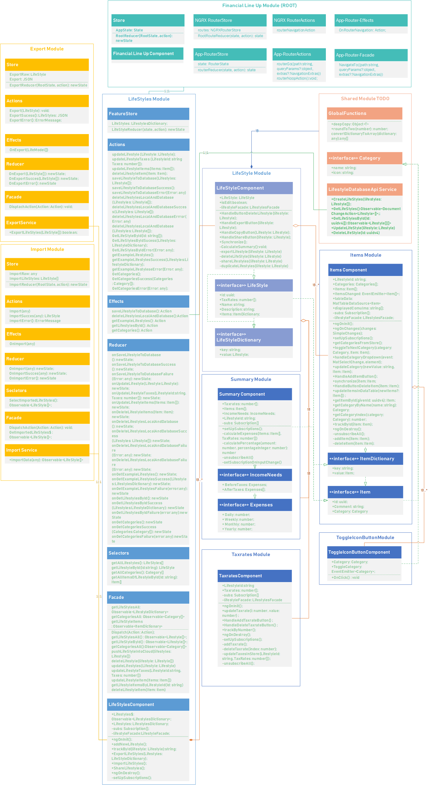

#Financial Line Up SRS  

### Requirements  
  
An Angular Webapp, that allows a user to do the following:
  
0. Enter lifestyles and their expenses on a categorical basis
0. Compare entered lifestyles on financial aspects
0. Spending per month / per year
0. What to earn before taxes / per month / per year 
0. What is left after taxes / per month / per year
0. CRUD - Operations for lifestyles
0. Duplicate lifestyles
0. Download & Upload lifestyles  
     0. JSON-Format  
     0. CSV-Format
0. (~) Display graphics for items on a categorical basis 

      
##### Legend  
(~): optional
  
## Used Technologies
  
 1. Angular 9
 2. NGRX (Overkill for this app, but in terms of extending this app, I am better safe than sorry)
 3. Firebase
 4. Cloud Firestore
 5. Google Analytics
 
 ## Development strategy
  1. Domain Driven Design
  
##Use-Case-Diagram  
  

  
  
##Class-Diagram
  

  
 
##Sequence-Diagram representative example
Loading the LifeStyles, when a user opens the page.

 
 
